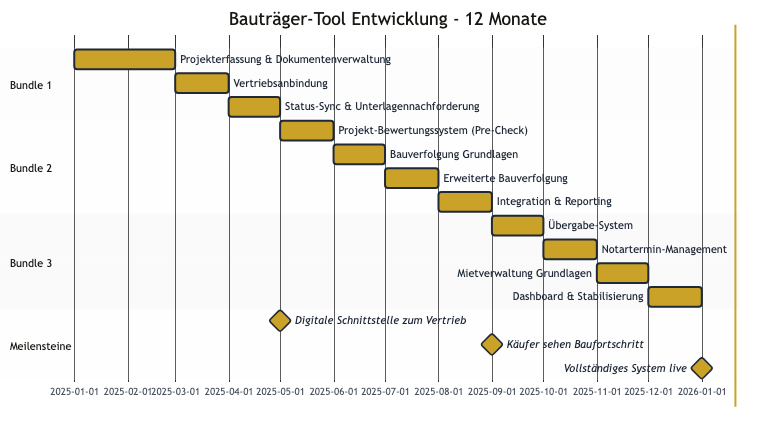
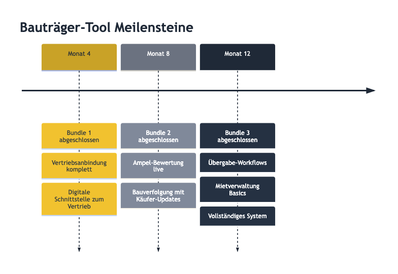

---
pdf_options:
  margin: 20mm
---

# Bauträger-Tool - 12-Monats-Produktentwicklung

## Produktvision

Vollständiges digitales Werkzeug für Bauträger zur Verwaltung von Bauprojekten - von der Projekteingabe über Vertriebsanbindung und Bauverfolgung bis zur Übergabe und Mietverwaltung.

**Modulares System:** Bauträger-Modul kann unabhängig oder kombiniert mit Sales-Modul genutzt werden.

---

## Entwicklungsplan: 3 Bundles à 4 Monate

| Bundle | Zeitraum | Schwerpunkt |
|--------|----------|-------------|
| **Bundle 1** | Monat 1-4 | Projekteingabe & Vertriebsanbindung |
| **Bundle 2** | Monat 5-8 | Projektbewertung & Bauverfolgung |
| **Bundle 3** | Monat 9-12 | Übergabe & Mietverwaltung |

---

# Bundle 1: Projekteingabe & Vertriebsanbindung

**Ziel:** Bauträger können Projekte vollständig digital erfassen und nahtlos an Vertriebspartner im BlackVesto Ökosystem übergeben.

## Monat 1-2: Projekterfassung & Dokumentenverwaltung

**Features:**
- Projekterstellung mit allen relevanten Daten (Adresse, Bauart, Fertigstellungstermin)
- Einheitenerfassung (Wohnungen, Gewerbe, Stellplätze)
- Benutzeranmeldung und Rechteverwaltung
- Dokumenten-Upload (Grundrisse, Baugenehmigung, Teilungserklärung, Energieausweis)
- Bildgalerie mit Kategorisierung (Außenansicht, Innenräume, Grundrisse)
- Vollständigkeitsprüfung (welche Unterlagen fehlen noch?)
- Finanzdaten pro Einheit (Kaufpreis, Abgabepreis, Miete, Nebenkosten)

**Nutzen:** Strukturierte Dateneingabe statt Excel-Listen und E-Mail-Chaos. Alle Projektunterlagen zentral an einem Ort.

---

## Monat 3: Vertriebsanbindung

**Features:**
- Projekt zur Prüfung an Vertriebspartner übergeben
- **Vertriebspipeline:** Vertrieb sieht eingereichte Projekte
- Projekt annehmen oder ablehnen
- Feedback-System mit Kommentaren
- **Preisverhandlung:**
  - Preisvorschläge mit Begründung
  - Gegenangebote vom Bauträger
  - Vollständige Verhandlungshistorie
- Automatische Datenübernahme bei Projektgenehmigung

**Nutzen:** Transparenter Prozess von Projekteinreichung bis Vertriebsstart, keine Missverständnisse bei Preisabsprachen.

---

## Monat 4: Status-Synchronisation & Unterlagennachforderung

**Features:**
- **Live-Status:** Bauträger sieht aktuellen Verkaufsstatus jeder Einheit
  - Frei / Reserviert / Notartermin / Verkauft
- Status-Timeline pro Objekt
- **Unterlagennachforderung:**
  - Vertrieb kann fehlende Dokumente anfordern
  - Bauträger lädt direkt im System hoch
  - Automatische Benachrichtigungen
- Digitale Schnittstelle zum Vertrieb (kein Mail oder WhatsApp mehr nötig)

**Nutzen:** Echtzeit-Überblick über Vertriebsfortschritt, schnelle Dokumentenbereitstellung ohne E-Mail-Ping-Pong.

---

## Bundle 1 Ergebnis

Nach 4 Monaten:
- ✅ Vollständige Projekterfassung inkl. aller Dokumente und Bilder
- ✅ Nahtlose Vertriebsanbindung mit Prüfungs- und Genehmigungsprozess
- ✅ Preisverhandlung mit vollständiger Historie
- ✅ Live-Status aller Verkäufe
- ✅ Digitale Unterlagennachforderung

---

# Bundle 2: Projektbewertung & Bauverfolgung

**Ziel:** Automatische Projektbewertung und lückenlose Dokumentation des Baufortschritts.

## Monat 5: Projekt-Bewertungssystem (Pre-Check)

**Features:**
- **Ampel-Bewertung** für schnelle Einschätzung:
  - 🟢🟡🔴 Energieeffizienz (A-H Klassen)
  - 🟢🟡🔴 Mietrendite (Bruttomietrendite)
  - 🟢🟡🔴 Hausgeld pro m²
  - 🟢🟡🔴 Lage-Preis-Verhältnis
- WG-Vermietungsplanung mit Zimmeraufteilung
- Standortanalyse mit Infrastruktur-Bewertung

**Nutzen:** Sofortige Einschätzung der Projektqualität, bessere Entscheidungsgrundlage für Vertriebspartner.

---

## Monat 6: Bauverfolgung Grundlagen

**Features:**
- Meilenstein-Planung (Rohbau, Innenausbau, Außenanlagen, Fertigstellung)
- Soll-/Ist-Termine pro Phase
- Fortschrittsanzeige in Prozent
- Foto-Dokumentation pro Bauphase
- Automatische Verzögerungserkennung

**Nutzen:** Strukturierte Baufortschrittsdokumentation, frühzeitige Erkennung von Verzögerungen.

---

## Monat 7: Erweiterte Bauverfolgung

**Features:**
- **Gantt-Diagramm:** Visualisierung aller Bauphasen
- **Kosten-Tracking:**
  - Budget pro Meilenstein
  - Ist-Kosten Erfassung
  - Abweichungswarnung
- Verzögerungs-Benachrichtigungen per E-Mail
- Massenaktualisierung für mehrere Meilensteine

**Nutzen:** Professionelles Projektmanagement mit Kosten- und Zeitkontrolle.

---

## Monat 8: Integration & Reporting

**Features:**
- Baufortschritt für Vertriebspartner sichtbar
- **Käufer-Updates:** Baufortschritt automatisch an Käuferportal (MyVesto)
- Foto-Sharing mit Käufern (optional)
- Verzögerungsindikatoren in allen Ansichten
- Fortschritts-Reports (PDF-Export)

**Nutzen:** Transparenz für alle Beteiligten, weniger Rückfragen zum Baustand.

---

## Bundle 2 Ergebnis

Nach 8 Monaten zusätzlich:
- ✅ Automatische Projektbewertung mit Ampel-System
- ✅ Vollständige Bauphasen-Dokumentation
- ✅ Gantt-Diagramm und Kosten-Tracking
- ✅ Automatische Benachrichtigungen bei Verzögerungen
- ✅ Baufortschritt für Käufer sichtbar

---

# Bundle 3: Übergabe & Mietverwaltung

**Ziel:** Digitale Übergabe-Protokolle und Grundlagen für Mietverwaltung.

## Monat 9: Übergabe-System

**Features:**
- Digitales Übergabeprotokoll
- Zählerstandserfassung (Strom, Gas, Wasser, Heizung) mit Foto
- Schlüsselprotokoll (Anzahl, Typ)
- Mängeldokumentation mit Fotos
- Status-Tracking (offen/behoben)

**Nutzen:** Rechtssichere digitale Übergabe, keine Papierformulare mehr.

---

## Monat 10: Notartermin-Management

**Features:**
- Terminvorschläge mit Kalenderintegration
- Bestätigungsstatus aller Parteien (Käufer, Verkäufer, Notar)
- Dokument-Checkliste für Notartermin
- Übergabeprotokoll als PDF
- Automatische Status-Aktualisierung nach Übergabe (→ Verkauft)

**Nutzen:** Koordination aller Beteiligten ohne Telefon-Marathon.

---

## Monat 11: Mietverwaltung Grundlagen

**Features:**
- Mieter-Stammdaten (Name, Kontakt, Einzugsdatum)
- Mietvertragserfassung:
  - Kaltmiete, Nebenkosten
  - Vertragslaufzeit
  - Kündigungsfristen
  - Staffelmiete (optional)
- Mieterübersicht pro Objekt und Projekt

**Nutzen:** Alle Mieterdaten zentral verwaltet, Grundlage für Miet-Controlling.

---

## Monat 12: Dashboard & Stabilisierung

**Features:**
- **Miet-Dashboard:**
  - Auslastungsquote
  - Leerstandsübersicht
  - Mieterliste mit Vertragsdetails
- Kündigungs-Tracking
- Vertrags-Timeline
- Systemstabilisierung und Performance-Optimierung

**Nutzen:** Überblick über alle Mietverhältnisse auf einen Blick.

---

## Bundle 3 Ergebnis

Nach 12 Monaten zusätzlich:
- ✅ Digitale Übergabeprotokolle
- ✅ Notartermin-Koordination
- ✅ Mieterverwaltung mit Vertragsdaten
- ✅ Auslastungs-Dashboard

---

# Gesamtübersicht: 12-Monats-Ergebnis

| Bereich | Features |
|---------|----------|
| **Projekteingabe** | Vollständige Datenerfassung, Dokumente, Bilder |
| **Vertriebsanbindung** | Pipeline, Genehmigung, Preisverhandlung mit Historie |
| **Live-Status** | Echtzeit-Verkaufsstatus, Unterlagennachforderung |
| **Projektbewertung** | Ampel-System (Energie, Rendite, Hausgeld, Lage) |
| **Bauverfolgung** | Meilensteine, Gantt, Kosten, Fotos, Benachrichtigungen |
| **Übergabe** | Protokolle, Zählerstände, Mängel, Notartermine |
| **Mietverwaltung** | Mieter, Verträge, Auslastung |

---

# Investition & Konditionen

## Entwicklungskosten

| Position | Betrag |
|----------|--------|
| **Gesamtentwicklung (12 Monate)** | **80.000 €** |
| Perpetual-Lizenzen | ✅ Inkludiert |
| Wartung ab Monat 13 | 500 €/Monat |

## Zahlungsplan

Monatliche Zahlung à **6.667 €** (12 Raten = 80.000 €)

## Projektbegleitung

- **Monatliche Präsentations-Calls** zur Fortschrittsbesprechung
- **Alpha-Testphase:** Features sind nach Abschluss jedes Monats testbar
- Direkter Draht zum Entwicklungsteam für Feedback

## Nach Fertigstellung (ab Monat 13)

- **Wartungsgebühr:** 500 €/Monat
- Inkludiert: Bugfixes, Sicherheitsupdates, kleine Anpassungen
- **Perpetual-Lizenzen:** Unbegrenzte Nutzung, keine zusätzlichen Lizenzkosten

---

# Anhang: Visueller Zeitplan

---

## Meilenstein-Übersicht

---

**Meilensteine:**
- **Monat 4:** Vertriebsanbindung komplett - Digitale Schnittstelle zum Vertrieb (kein Mail oder WhatsApp mehr nötig)
- **Monat 8:** Bauverfolgung mit Käufer-Updates live
- **Monat 12:** Vollständiges System inkl. Mietverwaltung
